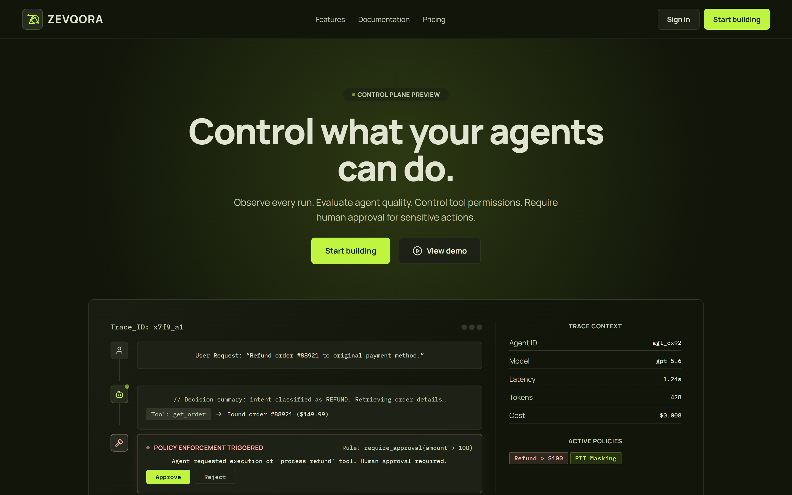
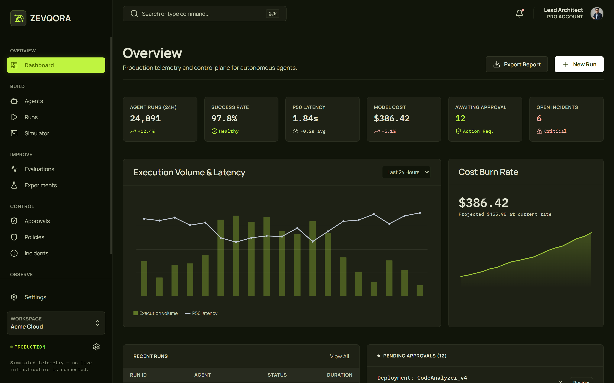
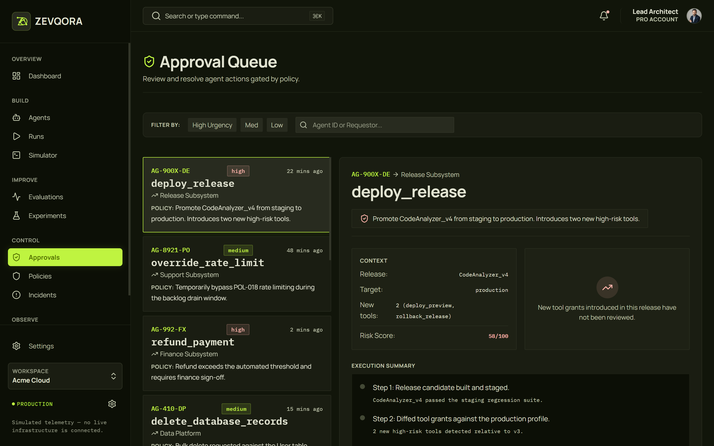
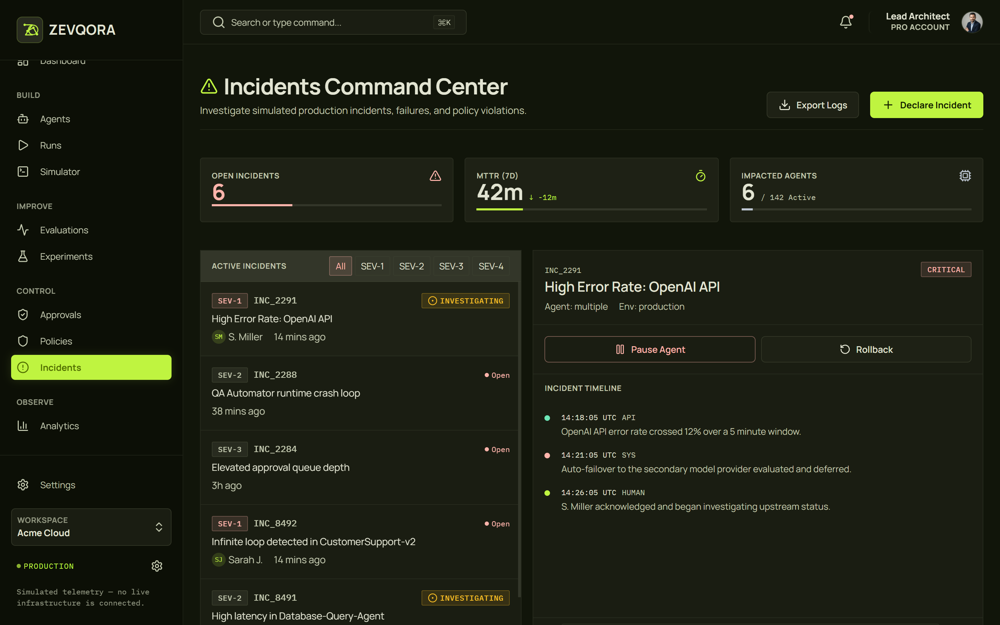
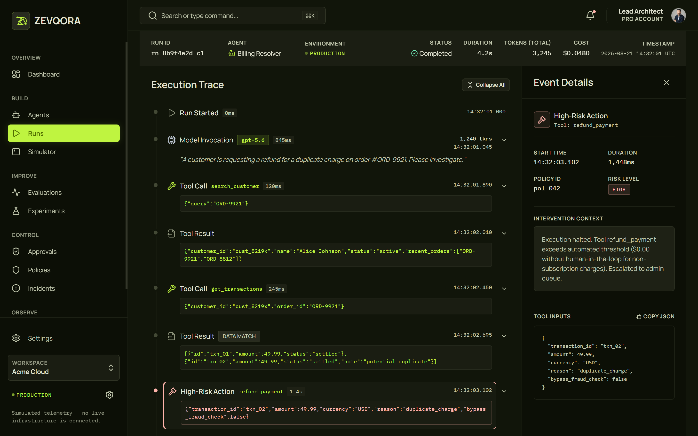

# ZEVQORA

**AI Agent Control Plane.**

> **Control what your agents can do.**

Observe agent execution. Evaluate quality. Control tool permissions. Require human approval for sensitive actions.

**[Live Demo](https://allahverdi-dev.github.io/zevqora/)** · **[GitHub Repository](https://github.com/allahverdi-dev/zevqora)**



---

## About ZEVQORA

ZEVQORA is a frontend demonstration of an **AI Agent Control Plane** designed for engineering teams building and operating autonomous or tool-using AI systems.

It brings observability, evaluation, governance, human approval, incident response, experimentation, and fleet-wide telemetry into one unified developer interface.

The product is built around a simple question:

> **What is the agent doing, why is it doing it, and should it be allowed to continue?**

ZEVQORA explores what a production-oriented control layer for AI agents could look and feel like.

---

## Important: What This Release Actually Is

**ZEVQORA is currently a frontend-only product demonstration. It does not execute real AI agents.**

There is currently:

- no production backend
- no database
- no real authentication
- no model-provider integration
- no real infrastructure telemetry
- no production policy enforcement
- no live API credentials

The application uses a deterministic mock-data and simulation layer to demonstrate the intended product experience end to end.

Specifically:

- Agent runs, traces, evaluations, incidents, approvals, and analytics are simulated.
- The Simulator uses a scripted browser-side execution engine.
- Approval decisions modify frontend session state only.
- Incident mitigation actions are simulated.
- API keys shown in Settings are fictional demo credentials.
- The workspace **Acme Cloud**, account identities, transactions, customers, and incidents are fictional.

The architecture is intentionally structured so that mock repositories can later be replaced by real API-backed repositories without rewriting the UI.

---

# Product Preview

## Overview Dashboard

Fleet-wide visibility into agent executions, latency, model cost, approvals, incidents, and recent runs.



---

## Human Approval Queue

Review high-risk actions before agents are allowed to execute them.

The approval workflow supports contextual inspection, policy information, risk scoring, execution evidence, approval, rejection, and shared session state.



---

## Incidents Command Center

Investigate simulated production failures, policy violations, latency spikes, crash loops, and other agent-runtime incidents.



---

## Execution Trace

Inspect an agent run step by step across model invocations, tool calls, tool results, policy interventions, and high-risk actions.



---

# Core Capabilities

## Agent Fleet

Manage and inspect a fleet of autonomous agents.

Each agent includes information such as:

- runtime status
- canonical model
- attached tools
- policy coverage
- operational health
- deployment metadata

Example agents include:

- SupportBot Alpha
- Billing Resolver
- QA Automator
- Security Triage Agent
- Onboarding Agent
- Research Agent

---

## Runs Explorer

Explore a deterministic corpus of agent executions with:

- search
- environment filtering
- status filtering
- agent filtering
- model filtering
- time-range filtering
- sortable data
- pagination
- URL-backed filter state

Each run exposes:

- run ID
- agent
- model
- status
- duration
- token usage
- estimated cost
- timestamp

Selecting a run opens its full execution trace.

---

## Execution Traces

Trace Inspection reconstructs the visible application-level execution path of a run.

A trace may contain:

```text
Run Started
↓
Model Invocation
↓
Tool Call
↓
Tool Result
↓
Model Invocation
↓
Policy Check
↓
Human Approval
↓
Tool Execution
↓
Final Response
↓
Run Completed
```

Each event can expose metadata such as:

- timestamps
- duration
- model
- token usage
- tool name
- tool arguments
- input/output
- risk level
- policy ID
- execution summary

ZEVQORA intentionally presents **execution summaries and system events**, not hidden model chain-of-thought.

---

## Agent Simulator

The Simulator is a working browser-side execution experience rather than a static mockup.

Users can:

1. select an agent
2. enter a test request
3. start a simulated run
4. watch execution events appear progressively
5. inspect tool calls
6. reach a policy gate
7. approve or reject the requested action
8. continue or terminate execution
9. inspect resulting telemetry

Example flow:

```text
Customer request
↓
Model invoked
↓
search_customer
↓
get_transactions
↓
Duplicate payment detected
↓
refund_payment requested
↓
Policy requires approval
↓
Human decision
↓
Execution continues or terminates
```

The simulator tracks demo telemetry such as:

- tokens
- cost
- latency
- tool-call count

---

## Evaluations

Evaluate agent behaviour across test suites and quality criteria.

The interface includes:

- evaluation suites
- evaluation run history
- pass/fail states
- aggregate system health
- model comparison
- criterion analysis

Example criteria include:

- accuracy
- safety
- hallucination resistance
- tone compliance

---

## Experiments

Compare models, prompts, retrieval strategies, and agent configurations.

Experiment views support:

- Variant A vs Variant B
- accuracy comparison
- latency comparison
- cost-per-request comparison
- traffic allocation
- experiment status
- experiment directory
- demo experiment creation

Each metric uses an independent visual scale so values with different units are not misleadingly compared against one shared axis.

---

## Human Approvals

Sensitive actions can be placed behind a human approval gate.

Examples include:

```text
refund_payment
deploy_release
override_rate_limit
delete_database_records
```

Approval requests include:

- urgency
- requesting agent
- policy
- subsystem
- risk score
- execution context
- action evidence
- approval/rejection controls

Approval state is shared with the Dashboard during the current browser session.

---

## Policies & Guardrails

Policies define what agents may do and when human intervention is required.

Supported policy concepts include:

```ts
allow;
deny;
require_approval;
rate_limit;
redact;
```

Example policies:

- Block PII Disclosure
- Require Approval for Refunds
- Rate Limit External API Calls

The policy interface supports:

- policy selection
- enabled/disabled state
- attached agents
- rule inspection
- editable demo configuration
- code-like policy definitions

Changes apply to the demo session only.

---

## Incident Response

The Incidents Command Center provides a structured workspace for agent-runtime failures and policy violations.

Capabilities include:

- severity filtering
- incident selection
- structured incident timelines
- impacted-agent visibility
- MTTR telemetry
- simulated mitigation
- simulated rollback
- local log export

Example incidents include:

- elevated provider error rate
- agent runtime crash loop
- approval queue saturation
- infinite execution loop
- high database-agent latency

---

## Fleet Analytics

Fleet Analytics provides long-term performance and cost telemetry.

Metrics include:

- total tokens
- estimated model cost
- latency percentiles
- success rate
- model usage

Supported periods:

```text
24H
7D
30D
```

The latency visualization shows independent:

- P50
- P90
- P99

series rather than incorrectly stacking percentile values.

Analytics snapshots can be exported as:

- CSV
- JSON

---

## Settings

The Settings experience demonstrates platform configuration for:

- organization identity
- workspace configuration
- environment switching
- execution limits
- API keys

The active environment is shared across the application.

API-key values are **fictional demo data only** and no real secret is generated or transmitted.

---

# Routes

Every primary navigation destination is implemented.

| Screen                   | Route          |
| ------------------------ | -------------- |
| Landing                  | `/`            |
| Dashboard                | `/dashboard`   |
| Agent Fleet              | `/agents`      |
| Runs Explorer            | `/runs`        |
| Trace Inspection         | `/runs/:runId` |
| Simulator                | `/simulator`   |
| Evaluations              | `/evaluations` |
| Experiments              | `/experiments` |
| Approval Queue           | `/approvals`   |
| Policies & Guardrails    | `/policies`    |
| Incidents Command Center | `/incidents`   |
| Fleet Analytics          | `/analytics`   |
| Settings                 | `/settings`    |

Example trace:

```text
/runs/rn_8b9f4e2d_c1
```

---

# Technology

| Concern                    | Technology                      |
| -------------------------- | ------------------------------- |
| Framework                  | React 19                        |
| Language                   | TypeScript                      |
| Build tool                 | Vite 7                          |
| Routing                    | React Router 7                  |
| Styling                    | CSS Modules + custom properties |
| Icons                      | Lucide React                    |
| Charts                     | Custom SVG components           |
| Unit / integration testing | Vitest                          |
| UI testing                 | React Testing Library           |
| Deployment                 | GitHub Pages                    |
| CI / deployment            | GitHub Actions                  |

The project deliberately uses:

- no CSS framework
- no component framework
- no charting library
- no backend framework

The interface and chart system are built specifically for ZEVQORA's visual language.

---

# Design System

ZEVQORA uses a developer-infrastructure visual system based on:

- dark olive / charcoal surfaces
- signal-lime interaction states
- restrained borders
- compact spacing
- high information density
- technical monospace metadata

Core principles:

```text
Precision
Control
Observability
Reliability
Technical clarity
```

### Typography

**Manrope**

Used for:

- navigation
- page titles
- descriptions
- interface copy

**IBM Plex Mono**

Used for:

- run IDs
- model IDs
- timestamps
- token counts
- costs
- durations
- tool names
- policy expressions
- structured technical data

### Signal colour

The ZEVQORA lime accent is intentionally reserved for:

- selected states
- successful/active runtime signals
- primary actions
- trace emphasis
- important telemetry

It is not used as a large decorative surface.

---

# Architecture

```text
src/
├── app/
│   ├── router
│   └── providers
│
├── routes/
│
├── components/
│   ├── ui/
│   ├── shell/
│   ├── charts/
│   └── trace/
│
├── features/
│
├── domain/
│
├── services/
│   ├── contracts/
│   └── mock/
│
├── mocks/
│
├── hooks/
│
├── lib/
│
├── styles/
│
└── tests/
```

The application separates:

```text
Presentation
↓
Feature logic
↓
Service contracts
↓
Repository implementations
↓
Mock data
```

---

# Backend-Ready Boundary

UI modules do not directly import raw mock datasets.

Instead, features depend on repository interfaces.

Example:

```ts
export interface AgentRepository {
  list(filter?: AgentFilter): Promise<Agent[]>;
  getById(id: AgentId): Promise<Agent | null>;
  getByIds(ids: readonly AgentId[]): Promise<Agent[]>;
  listModels(): Promise<AgentModel[]>;
}
```

The current implementation uses:

```text
MockAgentRepository
```

A future backend could provide:

```text
ApiAgentRepository
```

while keeping the consuming UI unchanged.

The same architecture is used for:

- agents
- runs
- evaluations
- experiments
- approvals
- policies
- incidents
- analytics
- settings

`services/index.ts` acts as the application composition root.

---

# Shared Data Coherence

The mock layer is designed as one connected product dataset rather than unrelated screen fixtures.

Examples:

- Runs reference real agents from the Agent Fleet.
- A run's model matches its agent's canonical deployment model.
- Trace data resolves from real demo runs.
- Approval policy IDs resolve to real policy records.
- Incident agents resolve to fleet agents.
- Dashboard approval counts use the same approval repository as Approval Queue.
- Dashboard incident counts use the same incident repository as Incidents.
- Environment changes in Settings update the global environment indicator.

The model catalog is centralized and currently includes examples such as:

- Claude Sonnet 5
- Claude Opus 5
- GPT-5.6
- Gemini 3 Pro
- Llama 4 Maverick

---

# Simulator Architecture

The Simulator is implemented as a framework-independent execution engine rather than scattered timers inside React components.

```text
SimulatorEngine
      ↓
state snapshots
      ↓
useSimulator
      ↓
React UI
```

Supported lifecycle:

```text
idle
↓
running
↓
awaiting_approval
↓
completed / rejected / cancelled / failed
```

The engine ensures:

- controlled scheduling
- explicit approval pauses
- cancellation safety
- stale-callback protection
- timer cleanup
- deterministic test behaviour

Timers are injectable, allowing tests to drive execution without depending on wall-clock timing.

---

# Deterministic Mock Data

ZEVQORA's generated data uses fixed seeds.

This means:

- the same runs appear after refresh
- analytics stay stable
- tests stay reproducible
- screenshots remain predictable
- cross-screen relationships remain coherent

Timestamps are also derived from controlled fixture data instead of arbitrary runtime randomness.

---

# Accessibility

Accessibility was treated as part of the implementation rather than a final visual patch.

Implemented considerations include:

- semantic HTML
- logical heading hierarchy
- skip navigation
- keyboard-accessible controls
- real links and buttons
- visible `:focus-visible` states
- `aria-current` navigation state
- `aria-sort` for sortable tables
- accessible dialogs
- focus trapping
- Escape-to-close
- focus restoration
- accessible icon-only controls
- live regions for status changes
- readable chart alternatives
- status communicated through text/icons as well as colour
- reduced-motion support

The Simulator remains understandable when animation is reduced.

---

# Responsive Behaviour

ZEVQORA is desktop-first because it represents a professional developer tool, but the product is fully responsive.

Verified viewport targets include:

```text
1600px
1440px
1280px
1024px
768px
430px
390px
360px
```

Responsive behaviour includes:

- desktop persistent sidebar
- tablet navigation drawer
- mobile off-canvas navigation
- inspector panels becoming sheets
- stacked layouts where appropriate
- internally scrollable dense tables
- internally scrollable technical code blocks
- mobile-friendly approval actions
- trace usability on narrow screens

Dense tables intentionally remain tables rather than turning every record into a giant mobile card.

---

# Testing

The project currently includes:

> **147 automated tests across six suites.**

The tests focus on behaviour rather than snapshots.

| Suite            | Coverage                                                                            |
| ---------------- | ----------------------------------------------------------------------------------- |
| Simulator Engine | Lifecycle, timers, approval pause, approve/reject, cancellation, telemetry          |
| Repositories     | Filtering, sorting, pagination, state mutation, shared counts, data coherence       |
| UI               | Navigation, filtering, trace selection, approvals, incidents, settings, experiments |
| Routing          | All product routes, trace params, 404, navigation integrity                         |
| Chart Math       | Metric normalization and percentile calculations                                    |
| Architecture     | Repository-boundary enforcement and dependency rules                                |

Important behaviours covered include:

- run filtering
- run sorting
- trace event selection
- approval resolution
- incident filtering
- simulated mitigation
- evaluation switching
- experiment comparison
- analytics-period changes
- API-key demo generation
- environment switching
- canonical model coherence
- shared Dashboard counts
- Simulator cleanup

---

# Quality Gates

The published release passes:

```text
TypeScript strict typecheck
ESLint
147 / 147 automated tests
Production build
```

Current lint state:

```text
0 errors
```

---

# Local Development

Requirements:

```text
Node.js 20+
npm
```

Clone:

```bash
git clone https://github.com/allahverdi-dev/zevqora.git
```

Enter the project:

```bash
cd zevqora
```

Install dependencies:

```bash
npm install
```

Start development:

```bash
npm run dev
```

---

## Available Commands

```bash
npm run dev
```

Start the Vite development server.

```bash
npm run typecheck
```

Run TypeScript strict checks.

```bash
npm run lint
```

Run ESLint.

```bash
npm run test
```

Run Vitest in watch mode.

```bash
npm run test:run
```

Run the Vitest suite once, including dialog scroll-lock lifecycle tests.

```bash
npx playwright install chromium webkit
npm run test:e2e
```

Run native scrolling regressions across desktop, laptop, tablet and phone widths.
The suite starts Vite automatically and checks wheel input, keyboard scrolling,
scrollbar dragging, horizontal tables, dialogs and drawer navigation. Chromium
also checks one-finger swipes; WebKit is tested at phone width in desktop mode
because Playwright cannot dispatch wheel or touch-drag in mobile WebKit.
Physical Android/iOS momentum and touchpad hardware still require device QA.
These browser tests also run before the GitHub Pages build.

```bash
npm run build
```

Create the production build.

```bash
npm run preview
```

Preview the production build locally.

---

# Deployment

ZEVQORA is deployed through **GitHub Pages** using **GitHub Actions**.

Live application:

**https://allahverdi-dev.github.io/zevqora/**

The deployment workflow:

1. installs dependencies
2. runs typecheck
3. runs lint
4. runs the automated tests
5. builds the production application
6. publishes the generated artifact to GitHub Pages

The Pages build uses:

```text
/zevqora/
```

as its Vite base path while local development continues to use `/`.

A static SPA fallback allows React Router routes to render when deep-linked on GitHub Pages.

---

# Security & Trust

ZEVQORA does not include real production credentials.

The repository has been checked for:

- `.env` files
- provider API keys
- bearer tokens
- private keys
- hard-coded passwords
- production secrets

The API-key interface contains only fictional masked credentials.

Raw Stitch development archives and temporary design-reference exports are not part of the public repository.

---

# Current Limitations

This version intentionally focuses on the frontend product experience.

It currently does **not** include:

- real user authentication
- persistent accounts
- production database
- real agent execution
- OpenAI / Anthropic / Google integrations
- production tool execution
- server-enforced policies
- server-side incident management
- WebSocket/SSE telemetry
- payment infrastructure
- persistent workspace configuration

State changes such as approvals, policies, and settings are demo-session behaviours.

---

# Future Backend Roadmap

The current architecture is intended to support a future backend layer.

Potential future capabilities include:

```text
Authentication
Organizations and Workspaces
RBAC
PostgreSQL
Persistent run history
Real agent telemetry ingestion
Provider integrations
SSE / WebSockets
Background workers
Encrypted credentials
Webhooks
Audit logs
GitHub integrations
Slack integrations
Billing
Production policy enforcement
```

---

# AI-Assisted Development

ZEVQORA was built through an **AI-assisted / vibe-coding workflow**.

The development process involved:

- **ChatGPT** — product direction, feature planning, architecture discussions, QA strategy, review, and iteration
- **Google Stitch** — interface exploration and approved visual design references
- **Claude Code** — implementation, refactoring, debugging, testing, responsive work, and deployment preparation

AI tools were used as implementation partners rather than hidden from the development story.

The project still required product-level decisions around:

- what to build
- which features belonged in the product
- information architecture
- interaction behaviour
- visual direction
- prompt design
- design evaluation
- implementation review
- QA
- bug identification
- iteration priorities
- GitHub organization
- deployment
- final acceptance

ZEVQORA is also part of an ongoing process of strengthening frontend-development knowledge while using modern AI-assisted software-building workflows.

---

# Product Philosophy

ZEVQORA is built around four principles:

### Observe

Know what an agent executed.

### Evaluate

Measure whether it performed well.

### Govern

Define what it is allowed to do.

### Intervene

Put a human in the loop when the risk is too high.

---

## ZEVQORA

**Observe. Evaluate. Govern.**

**Control what your agents can do.**

**[Open Live Demo](https://allahverdi-dev.github.io/zevqora/)**
